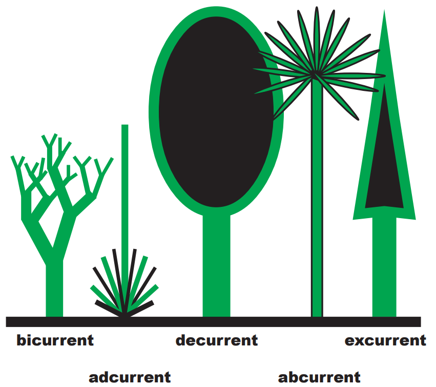
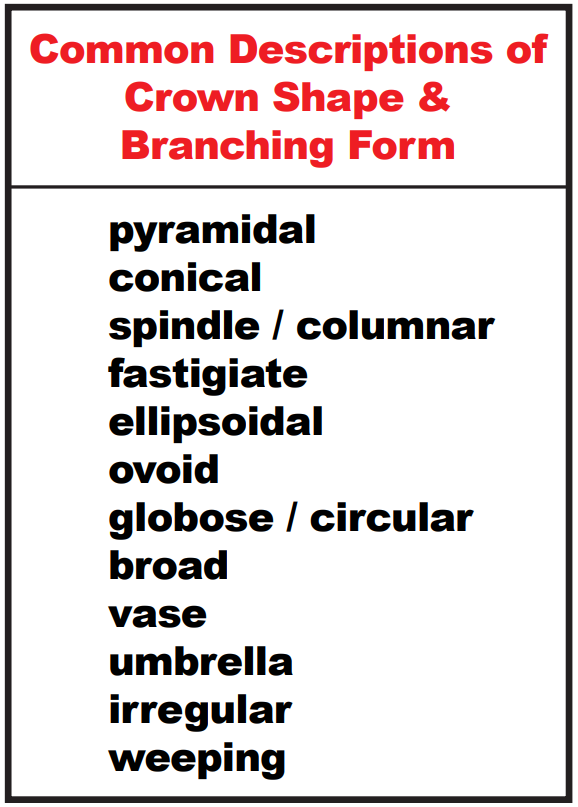
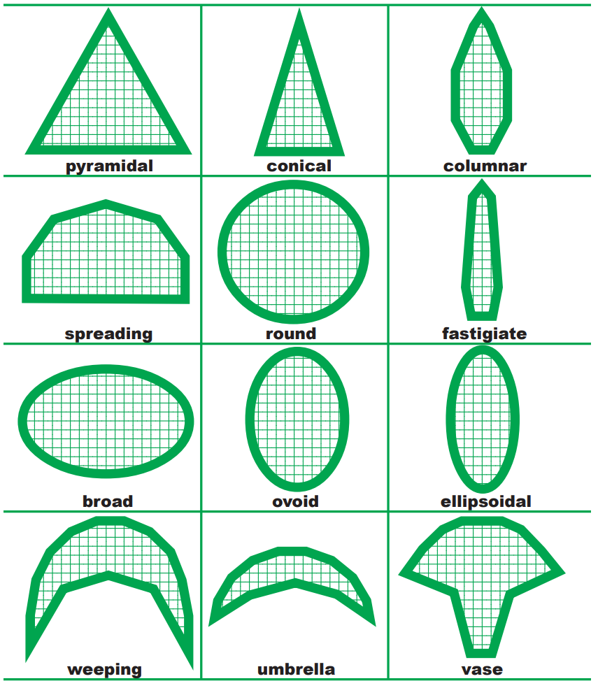

# VisiTrees
Tree species list and related assets to support visualization applications. Assets include: simple colors for species, crown and bole shape information, images for complete trees, and images for various tree parts (bark, crown, branch). The intent is to provide an open-source resource that can be used by anyone developing visualzations involving trees.

# Starting Point
The initial tree lists came from the Forest Inventory and Analysis (FIA) program and the [rSVS R package](https://github.com/Rayonier/rSVS) developed by Jim McCarter with Rayonier. FIA is responsible for the national forest inventory in the United States so their species list represents species that are measured during data collection to support the inventory. Jim's list started with the list from FIA (older version) and added additional species from the [USDA Plants Database](https://plants.usda.gov/home) maintained by the Natural Resources Conservation Service (NRCS) program. The two lists are very similar. Their differences are, most likely, not significant regarding visualization needs. One significant difference is that the rSVS list includes species group codes but the FIA list does not (for the most part). While such group codes seems useful, VisiTrees implements the same capability by providing species group level visualzation assets.

A subset of the FIA tree list that includes FIA species codes <1000 was extracted to serve as the starting point for VisiTrees. Columns were rearranged and some were deleted to create the MasterSpeciesList.

Beginning with the species list, the database adds fields describing the basic tree form and tree condition. Additional attributes can be used to provide models representing various damage agents or times of year. While this provides a tremendous amount of flexibility, it quickly adds up to lots of tree models and texture images. For the initial database, not all details are needed.

# Tree growth forms
An excellent publication by Dr. Kim D. Coder (Coder 2018) describes tree growth processes and presents the most common overall growth patterns and a set of crown shapes. Basic growth forms are:
* Abcurrent tree forms have an aerial terminal bud and leaves (palm-like).
* Adcurrent tree forms have basal buds and leaves (ground hugging yucca-like).
* Bicurrent tree forms have irregular forked branching usually with thick green stems (catus-like).
* Decurrent (deliquescent) tree forms have many dominant branches with a spreading crown form caused by lateral branches growing at similar rates as the main axis terminal (leader), or the terminal continues to die with lateral branches rebranching continuously (so no one central axis develops, but many spreading branches).
* Excurrent tree form has a single dominant axis (leader) and forms a conical shaped crown as the terminal elongates more annually than lateral branches (a distinct main axis and many short secondary branches.
The most common of these are excurrent (conifers) and decurrent (hardwoods).

Given these basic growth forms, Coder defines a series of generalized crown shapes useful for developing tree models. There may be more detail in these shapes than needed for abstract tree models. In addition, many (most?) species exhibit different forms depending on their competative environment, age, and degree of crown damage. Nonetheless, these forms provide a set of terminology useful for our tree database.

# Tree condition
The Stand Visualization System defined four tree forms for each species for use with output from the Forest Vegetation Simulator (FVS) and the fire and fuels extension (FFE): dead due to fire with foliage consumed and downward curled branches, dead due to fire with discolored branches/foliage, dead due to FVS background mortality with orange or brown branches/foliage, live with green branches/foliage. While not perfect, these conditions provide a starting point for a new database. Initial condition options are:
* LIVE
* RECENTDEAD (branches intact, foliage discolored)
* OLDDEAD (most branches gone, no foliage)
* SCORCHED (bole discolored, foliage discolored)
* CONSUMED (bole discolored, branches sparse and discolored, no foliage
The latter two conditions are meant for use with fire simulations. The first dead condition is meant to represent natural mortality. The "old dead" condition represents snags and could be the result of natural mortality or fire-related mortality.

# Damage class
Tree and crown damage are mostly intended for damage related to insects and disease. Damage class could also be used for fire-related damage but fire effects are represented in the tree condition options. Adding a full range of damage classes may represent too much detail and would require several images for each species to represent various types and levels of damage. For the initial database, all species only have records with damage class set to NONE.

# Time of year
Most tree species change their appearance through the course of the year. Most obvious are deciduous trees whose foliage changes color in the fall and is absent in the winter and early spring. However, conifers also have different appearances when actively growing compared to periods of slow or no growth. For the initial database, valid time-of-year values are DORMANT, SUMMER, and FALL. For deciduous broadleaf species, DORMANT would have no foliage SUMMER would have green foliage, and FALL would have foliage with characteristic colors for the species. For conifer species DORMANT and FALL would have uniform green foliage and SUMMER would have a mix of dark and light green foliage with lighter green toward the branch tips.

# References
Coder, Kim D. 2018. Tree anatomy: Defining trees & forms. Warnell School of Forestry & Natural Resources, University of Georgia, (Outreach Publication WSFNR-19-35)[https://bugwoodcloud.org/resource/files/15277.pdf]. Pp.20.
